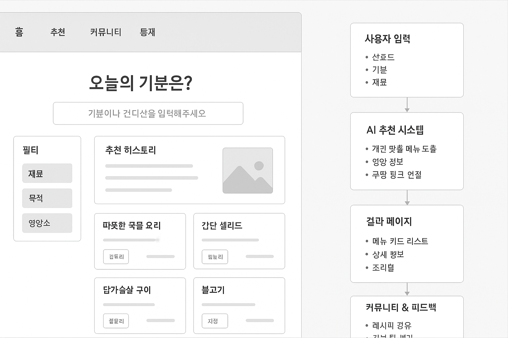

## 👤 ① **USER_TB (회원/유저 관리 담당)** (유희재)

**담당자:** 로그인·회원가입·마이페이지 CRUD

CREATE TABLE users (
    id          VARCHAR2(30)     PRIMARY KEY,                 -- 사용자 고유 ID
    password    VARCHAR2(100)    NOT NULL,                    -- 비밀번호 (암호화 저장)
    nickname    VARCHAR2(50)     NOT NULL,                    -- 닉네임
    email       VARCHAR2(100)    UNIQUE,                      -- 이메일 (로그인용)
    preference  VARCHAR2(100),                                -- 선호 음식 or 식단 유형
    allergy     CHAR(1),                                      -- 알러지 (추후 별도 테이블과 연동 예정)
    join_date   DATE            DEFAULT SYSDATE               -- 가입일
);


---

## 🍜 ② **FOOD_TB (음식 관리 담당)** (김정민)

**담당자:** 음식 등록 / 수정 / 삭제 / 조회

음식 등록 / 수정 / 삭제 / 조회 / 컬럼명 / 타입 / 제약조건 / 설명 

| 컬럼명         | 타입             | 제약조건         | 설명                                     |
| -----------   | -------------    | --------------- | ----------------------                   | 
|    food_id    |   NUMBER(6)      |     PRIMARY KEY,|  -- 음식 고유번호 (PK)                    |
|    name       |    VARCHAR2(100) |   NOT NULL,     |  -- 음식명                                |
|    category   |   VARCHAR2(50),  |                 |  -- 음식 카테고리 (예: 한식, 양식, 중식 등) |
|    difficulty |  VARCHAR2(20),   |                 |  -- 조리 난이도 (쉬움 / 보통 / 어려움)      |
|    kcal       |     NUMBER(5),   |                 |  -- 칼로리                                |
|    protein    |    NUMBER(5,1),  |                 |  -- 단백질(g)                             |
|    carb       |    NUMBER(5,1),  |                 |  -- 탄수화물(g)                           |
|    fat        |    NUMBER(5,1),  |                 |  -- 지방(g)                               |
|    recipe     |    CLOB,         |                 |  -- 조리 방법 (긴 텍스트)                  |
|    image_url  |   VARCHAR2(200), |                 |  -- 음식 이미지 경로                      |
|    like_count |  NUMBER(6)       |   DEFAULT 0     |  -- 좋아요 수 (기본값 0)                   |

---

## 🧄 ③ **INGREDIENT_TB (재료 관리 담당)** (김서현)

**담당자:** 재료 등록 / 수정 / 삭제 / 음식-재료 매핑 관리


| 컬럼명             | 타입            | 제약조건       |     설명                     |
| --------------- | ------------- | --------------- | ---------------------- |
| `ingredient_id` | NUMBER(6)     | PK              | 재료 고유번호                |
| `name`          | VARCHAR2(100) | NOT NULL        | 재료명                    |
| `type`          | VARCHAR2(50)  |                 | 종류 (채소, 육류, 해산물, 소스 등) |
| `kcal_per_100g` | NUMBER(5)     |                 | 100g당 칼로리              |
| `allergy_flag`  | CHAR(1)       | DEFAULT 'N'     | 알러지 유발 여부              |
| `created_at`    | DATE          | DEFAULT SYSDATE | 등록일                    |


### 📦 음식-재료 매핑 테이블 (N:N 관계)
#### `FOOD_INGREDIENT_TB`

| 컬럼명             | 타입           | 제약조건               | 설명                     |
| --------------- | ------------ | ------------------ | ---------------------- |
| `food_id`       | NUMBER(6)    | FK → FOOD_TB       | 음식 ID                  |
| `ingredient_id` | NUMBER(6)    | FK → INGREDIENT_TB | 재료 ID                  |
| `amount`        | VARCHAR2(50) |                    | 사용량 (예: “200g”, “1큰술”) |


---

## 🔍 ④ **RECOMMEND_TB / SEARCH_LOG_TB (추천 & 검색 담당)** (김영민)

**담당자:** 메뉴 추천, 검색 히스토리 저장, AI 피드백

### `RECOMMEND_TB`

| 컬럼명          | 타입            | 제약조건            | 설명                     |
| ------------ | ------------- | --------------- | ---------------------- |
| `rec_id`     | NUMBER(8)     | PK              | 추천 고유번호              |
| `user_id`    | VARCHAR2(30)  | FK → USER_TB    | 사용자 ID                 |
| `food_id`    | NUMBER(6)     | FK → FOOD_TB    | 추천된 음식                |
| `type`       | VARCHAR2(30)  |                 | 추천 유형 (AI, 랜덤, 재료기반 등) |
| `feedback`   | VARCHAR2(200) |          null   | AI 피드백 (예: 단백질 부족)     
|` is_favorite` |CHAR(1) | DEFAULT| 'N' 사용자가 추천| 음식을 ‘찜’했는지 여부 ('Y': 찜함, 'N': 안함) |
| `created_at` | DATE          | DEFAULT SYSDATE | 추천 일시                  |


### `SEARCH_LOG_TB`

| 컬럼명          | 타입            | 제약조건            | 설명                |
| ------------ | ------------- | --------------- | ----------------- |
| `search_id`  | NUMBER(8)     | PK              | 검색 기록 ID          |
| `user_id`    | VARCHAR2(30)  | FK → USER_TB    | 사용자 ID            |
| `keyword`    | VARCHAR2(100) |                 | 검색 키워드            |
| `filter`     | VARCHAR2(100) |                 | 필터 조건 (비건, 고단백 등) |
| `recent_search` |CHAR(1) | DEFAULT | 'Y' 해당 검색어를 최근 검색 목록에 표시할지 여부 ('Y': 표시, 'N': 비표시)||
| `created_at` | DATE          | DEFAULT SYSDATE | 검색 시각             |

---

## 🧑‍🍳 ⑤ **COMMUNITY_TB / REVIEW_TB (커뮤니티 담당)** (길상현)

**담당자:** 게시글/리뷰 CRUD 

### 🔸 `COMMUNITY_TB` — 레시피 공유 게시판 

| 컬럼명          | 타입            | 제약조건                                        | 설명               |
| ------------ | ------------- | ------------------------------------------- | ---------------- |
| `post_id`    | NUMBER(8)     | PK                                          | 게시글 ID           |
| `user_id`    | VARCHAR2(30)  | NOT NULL, FK → USER_TB(user_id)             | 작성자              |
| `title`      | VARCHAR2(200) | NOT NULL                                    | 제목               |
| `content`    | CLOB          | NOT NULL                                    | 본문 (레시피 내용)      |
| `category`   | VARCHAR2(50)  |                                             | 카테고리 (디저트, 한식 등) |
| `views`      | NUMBER(6)     | DEFAULT 0                                   | 조회수              |  +
| `likes`      | NUMBER(6)     | DEFAULT 0                                   | 좋아요 수            |
| `created_at` | DATE          | DEFAULT SYSDATE                             | 작성일              |
| `updated_at` | DATE          |                                             | 수정일              |+
| `is_deleted` | varchar(2)    |                                             | 삭제 이력 관리      | +


---

### 🔸 `COMMUNITY_IMAGE_TB` — 게시글 이미지 (다중 이미지용)

| 컬럼명          | 타입            | 제약조건                       | 설명     |
| ------------ | ------------- | -------------------------- | ------ |
| `image_id`   | NUMBER(8)     | PK                         | 이미지 ID |
| `post_id`    | NUMBER(8)     | FK → COMMUNITY_TB(post_id) | 게시글 ID |
| `image_url`  | VARCHAR2(300) | NOT NULL                   | 이미지 경로 |
| `created_at` | DATE          | DEFAULT SYSDATE            | 등록일    |

---

### 🔸 `REVIEW_TB` — 음식 리뷰

| 컬럼명          | 타입            | 제약조건                                        | 설명       |
| ------------ | ------------- | ------------------------------------------- | -------- |
| `review_id`  | NUMBER(8)     | PK                                          | 리뷰 ID    |
| `user_id`    | VARCHAR2(30)  | NOT NULL, FK → USER_TB(user_id)             | 작성자      |
| `food_id`    | NUMBER(6)     | NOT NULL, FK → FOOD_TB(food_id)             | 리뷰 대상 음식 |
| `rating`     | NUMBER(2,1)   | CHECK (rating BETWEEN 0 AND 5)              | 별점       |
| `comment`    | VARCHAR2(500) |                                             | 후기 내용    |
| `like_count` | NUMBER(6)     | DEFAULT 0                                   | 좋아요 수    |+
| `created_at` | DATE          | DEFAULT SYSDATE                             | 작성일      |
| `updated_at` | DATE          |                                             | 수정일      |+
| `is_deleted` | varchar(2)    |                                             | 삭제 이력 관리  |+

---

# 🍽 메뉴 추천 웹페이지 기능 정리

## 1. 사용자 입력 기반

* **선호도/질문 등록**:
  * 사용자 선호 음식, 영양소, 알레르기 성분 입력
  * 예: “단백질 많은 음식 좋아하시나요?” / “글루텐 알러지 있음”
* **재료 입력**:
  * 냉장고 속 재료 기반 메뉴 추천

---

## 2. 맞춤형 추천 기능

* **개인 맞춤 메뉴 추천**:
  * 선호도, 식사 목적(다이어트/회식/혼밥/해장 등) 기반 추천
  * AI 학습형 추천: 사용자의 행동·선호 기록 기반 메뉴 자동 추천
* **영양/칼로리 관리**:
  * 음식의 영양 정보 제공 (탄단지 비율, 칼로리)

  
 <!-- * 사용자의 일일 섭취량 통계 제공
  * 고단백/저탄수/저염 등 영양소 필터링
-->
---

## 3. 음식 DB 및 검색

* **음식 정보 상세보기**:
  * 음식 이름, 영양소, 조리법 등 정보 제공
* **검색 기능**:
  * 키워드, 카테고리(영양소·선호음식) 기반 검색
  * 재료·목적 기반 검색
<!--
* **쿠팡 연동**:
  * 이름/가격/영양소/구매 링크 제공
-->

---

## 4. 커뮤니티 및 피드백

* **레시피 공유 게시판**:
  * 사용자 레시피 업로드, 댓글, 좋아요 기능
* **리뷰 & 평가**:
  * 추천 메뉴에 대한 만족도 평가 및 히스토리 저장

---

## 5. 시각화 및 통계

* **추천 메뉴 영양 시각화**:
  * 그래프 형태로 탄단지 비율, 칼로리 등 표시
* **선호도 기반 통계**:
  * 동일 음식 카테고리 추천, 인기 메뉴 통계 제공

---

💡 **정리 포인트**

* 입력 → 맞춤 추천 → 상세 정보 → 구매/레시피 → 피드백
* 개인화, 상황 기반, 재료 기반, 커뮤니티 참여까지 **원스톱 경험** 제공


[사용자 입력]
 ├─ 선호도 / 기분 / 재료 입력
 ↓
[AI 추천 시스템]
 ├─ 개인 맞춤 메뉴 도출
 ├─ 영양 정보 / 쿠팡 링크 연결
 ↓
[결과 페이지]
 ├─ 메뉴 카드 리스트
 ├─ 상세 정보 / 조리법 / 구매 / 저장
 ↓
[커뮤니티 & 피드백]
 ├─ 레시피 공유
 └─ 리뷰 및 평가 → 학습 피드백으로 환류

 

 
<br/>
<br/>
<br/>
<br/>
<br/>

 ---
 
 - 1.기획의도 
 ```
현대인들은 바쁜 일상 속에서 **‘오늘 뭐 먹지?’**라는 고민을 매일 반복합니다.
특히 건강, 영양, 다이어트 등 개인 맞춤형 식단에 대한 관심이 높아지면서 단순한 음식 추천이 아닌 개인 취향과 영양 밸런스를 고려한 메뉴 추천 서비스의 필요성이 커지고 있습니다.

이 프로젝트는 사용자의 선호도, 영양소 관심도, 건강 목표 등을 기반으로 맞춤 메뉴를 추천하고, 관련 상품과 레시피 정보를 통합 제공하는 스마트 음식 추천 플랫폼을 목표로 합니다.
 ```

 - 2.아이디어
 ```
1. 사용자 선호 음식or영양소 질문/보기 등록 (question 테이블)
2. 진단페이지 (choice)
3. 음식 정보 상세보기 (foodtype / energytype)
4. 음식 검색 기능 (foodtype / energytype)
5. 카테고리(영양소,선호음식) 음식 검색 (foodtype / energytype)
6. 쿠팡과의 연동 이름/가격/영양소/링크 (CUPANGDATA)
7. 레시피 공유 게시판 (USERFEEDBACK)

 ```

 - 3.테이블
 ```
question(질문), choice(진단), foodtype / energytype(음식정보), CUPANGDATA(쿠팡연동), USERFEEDBACK(게시판)
 ```


 ---

 기획의도 - 오늘의 메뉴 알리미는 사용자의 식습관, 영양 선호, 기분 상태 등을 기반으로 맞춤형 음식메뉴를 추천하는  영양소 알리미입니다,
 해당 알리미는 개인의 건강 목표, 선호도, 알레르기 정보 등을 반영하여 영양 균형과 만족도를 동시에 높이는 식사 제안을 제공합니다.
 또한, 커뮤니티 기능을 통해 사용자 간 레시피 공유 및 피드백을 주고받을 수 있습니다.

아이디어 - 필요로하는 기능 모두 적으주시면 감사하겠습니다. (최소 3개이상)
- 1. 사용자 선호 음식/영양소 질문 및 보기 등록 (예: "단백질 많은 음식 좋아하시나요?")
- 2. 선호도 기반 유사 음식 카테고리 통계 및 추천
- 3. 사용자 기분/상태 기반 메뉴 추천 (예: 스트레스 → 진정 효과 있는 음식 추천)
- 4. 알레르기/기피 성분 필터링 기능
- 5. 커뮤니티 기반 레시피 공유 및 좋아요/댓글 기능
- 6. 추천 메뉴의 영양 정보 시각화 (예: 탄단지 비율 그래프)

모듈별 주요 테이블 : Question (질문 문항 저장 / 어떤맛을 선호하시나요) , Choice (각 질문에 대한 선택지 저장) , FoodType (음식 카테고리 정보 / 양식, 한식, 고단백, 중식 등), EnergyType (영양소 정보 / 단백질, 탄수화물, 지방),
                      질문 선호 등록                                    질문 선호 등록                            음식 분류                                                영양소 분류
                    UserProfile (사용자 기본 정보 및 선호도 저장) , Recommendation (추천된 메뉴 및 이유 저장 ), Recipe (사용자 레시피 등록 정보), Comment(레시피에 대한 댓글 및 피드백), Allergy (알레르기 성분 정보 및 사용자 연결)
                    사용자 정보                                        추천결과                                커뮤니티                          커뮤니티                                필터링 ← 필터링은 선택지


---

## 냉장고 속 재료 기반 요리 추천 앱
  - 냉장고 속 재료를 입력하면 자동으로 메뉴 추천 및 레시피 소개
  - 부족한재료 구매링크를 통한 수수료나 직접판매로 수익 창출 가능


- 사용자가 냉장고 속 재료를 입력하면, 해당 재료로 만들 수 있는 요리 추천

- MBTI, 식습관, 선호도 기반으로 맞춤형 레시피 제공

- 영양소 필터링: 고단백, 저탄수, 저염 등

- 재료 소진 관리: 유통기한 임박 재료 우선 추천

- 레시피 공유 및 평가 기능

---

메뉴 추천 알고리즘
<br>
음식 DB와 사용자 성향을 매칭하여 맞춤 메뉴 제공
추천 히스토리 저장, 사용자 만족도 평가 가능
최소 기능: user_food_pref, recommendation_history 테이블

일정/기분 기반 추천
<br>
일정(점심/저녁 회식 등)과 감정(피곤, 스트레스)에 따른 맞춤 추천
최소 기능: schedule, mood 테이블

커뮤니티 & 리뷰 기능
<br>
추천 메뉴에 대한 리뷰, 평가, 공유
최소 기능: review, comment, user_like 테이블

영양/칼로리 관리
<br>
추천 음식의 영양 정보 제공
사용자의 일일 섭취량 통계 제공
최소 기능: nutrition, daily_intake 테이블


| 모듈       | 테이블                    | 설명                     |
| -------- | ---------------------- | ---------------------- |
| 사용자 선호   | user_food_pref         | 사용자 음식 선호 기록           |
| 추천       | recommendation_history | 추천 메뉴와 추천 이유 기록        |
| 일정 & 기분  | schedule               | 사용자의 일정 기록             |
| 커뮤니티     | review                 | 메뉴 리뷰                  |
| 〃        | comment                | 리뷰 댓글                  |
| 〃        | user_like              | 좋아요/추천 기능              |
| 영양 관리    | nutrition              | 음식 영양 정보               |
| 〃        | daily_intake           | 사용자의 일일 섭취 기록          |


---

🍽️ 메뉴 추천 플랫폼 아이디어 
1. 기분 기반 추천 플랫폼
- 사용자가 현재 기분을 선택하면 그에 맞는 음식 추천
- 예: "우울해요" → 따뜻한 국물 요리 / "기분 좋아요" → 활기찬 색감의 샐러드
📌 핵심 모듈:
- Mood 선택지 테이블
- Mood → Food 매핑 테이블

2. 시간대/날씨 기반 추천
- 현재 시간과 날씨에 따라 메뉴 추천
- 예: 비 오는 저녁 → 전, 국물 요리 / 맑은 아침 → 샌드위치, 커피
📌 핵심 모듈:
- Weather API 연동
- TimeSlot → Food 매핑 테이블

3. 식사 목적 기반 추천
- 사용자가 식사 목적을 선택: 다이어트, 회식, 혼밥, 해장 등
- 목적에 따라 메뉴 추천
📌 핵심 모듈:
- Purpose 선택지 테이블
- Purpose → Food 매핑 테이블

4. 재료 기반 추천
- 냉장고에 있는 재료를 입력하면 만들 수 있는 메뉴 추천
- 예: "계란, 양파, 밥" → 계란볶음밥, 오믈렛
📌 핵심 모듈:
- Ingredient 테이블
- Ingredient → Recipe 매핑

5. 지역 기반 추천
- 사용자의 위치 또는 선택한 지역에 따라 지역 특산 메뉴 추천
- 예: 부산 → 밀면 / 전주 → 비빔밥
📌 핵심 모듈:
- Region 테이블
- Region → Food 매핑

6. 사용자 행동 기반 추천 (AI 학습형)
- 사용자가 자주 선택하는 메뉴를 학습해 자동 추천
- 예: 평일 점심엔 항상 면 요리 → 자동 면류 추천
📌 핵심 모듈:
- UserHistory 테이블
- 추천 알고리즘 (기초 rule 기반 or ML 확장 가능)


---

1. 사용자 선호 음식or영양소 질문/보기 등록 (question 테이블)
2. 진단페이지 (choice)
3. 음식 정보 상세보기 (foodtype / energytype)
4. 음식 검색 기능 (foodtype / energytype)
5. 카테고리(영양소,선호음식) 음식 검색 (foodtype / energytype)
6. 쿠팡과의 연동 이름/가격/영양소/링크 (CUPANGDATA)
7. 레시피 공유 게시판 (USERFEEDBACK)
---
- 1. 사용자 선호 음식/영양소 질문 및 보기 등록 (예: "단백질 많은 음식 좋아하시나요?")
- 2. 선호도 기반 유사 음식 카테고리 통계 및 추천
- 3. 사용자 기분/상태 기반 메뉴 추천 (예: 스트레스 → 진정 효과 있는 음식 추천)
- 4. 알레르기/기피 성분 필터링 기능
- 5. 커뮤니티 기반 레시피 공유 및 좋아요/댓글 기능
- 6. 추천 메뉴의 영양 정보 시각화 (예: 탄단지 비율 그래프)
---
- 사용자가 냉장고 속 재료를 입력하면, 해당 재료로 만들 수 있는 요리 추천
- MBTI, 식습관, 선호도 기반으로 맞춤형 레시피 제공
- 영양소 필터링: 고단백, 저탄수, 저염 등
- 재료 소진 관리: 유통기한 임박 재료 우선 추천
- 레시피 공유 및 평가 기능
---
1. 기분 기반 추천 플랫폼
- 사용자가 현재 기분을 선택하면 그에 맞는 음식 추천
- 예: "우울해요" → 따뜻한 국물 요리 / "기분 좋아요" → 활기찬 색감의 샐러드
2. 시간대/날씨 기반 추천
- 현재 시간과 날씨에 따라 메뉴 추천
- 예: 비 오는 저녁 → 전, 국물 요리 / 맑은 아침 → 샌드위치, 커피
3. 식사 목적 기반 추천
- 사용자가 식사 목적을 선택: 다이어트, 회식, 혼밥, 해장 등
- 목적에 따라 메뉴 추천
4. 재료 기반 추천
- 냉장고에 있는 재료를 입력하면 만들 수 있는 메뉴 추천
- 예: "계란, 양파, 밥" → 계란볶음밥, 오믈렛
5. 지역 기반 추천
- 사용자의 위치 또는 선택한 지역에 따라 지역 특산 메뉴 추천
- 예: 부산 → 밀면 / 전주 → 비빔밥
6. 사용자 행동 기반 추천 (AI 학습형)
- 사용자가 자주 선택하는 메뉴를 학습해 자동 추천
- 예: 평일 점심엔 항상 면 요리 → 자동 면류 추천
---
1. 음식 DB와 사용자 성향을 매칭하여 맞춤 메뉴 제공
추천 히스토리 저장, 사용자 만족도 평가 가능
2. 일정/기분 기반 추천
일정(점심/저녁 회식 등)과 감정(피곤, 스트레스)에 따른 맞춤 추천
3. 커뮤니티 & 리뷰 기능
추천 메뉴에 대한 리뷰, 평가, 공유
4. 영양/칼로리 관리
추천 음식의 영양 정보 제공
사용자의 일일 섭취량 통계 제공

